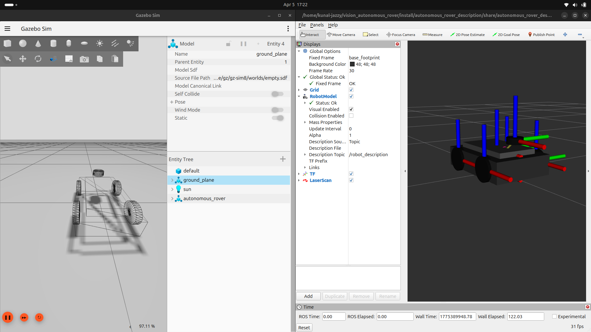

<p align="center">
  
</p>

<p align="center">
  
  
  
</p>

<h1 align="center">ROS 2 Autonomous Rover</h1>

<p align="center">
A <b>simulation-first autonomous mobile robot</b> built using <b>ROS 2 (Jazzy)</b> and <b>Gazebo (gz-sim)</b>, focusing on core autonomy concepts such as perception, decision-making, and control through a clean ROS2 architecture and a transparent Finite State Machine (FSM).
</p>

---

## 🎥 Demo

<p align="center">
  
</p>

---

## 🌟 Why This Project?

This project was developed to:

- Gain hands-on experience with **end-to-end autonomous robot architecture**
- Practice **ROS 2 node-based modular design**
- Implement **FSM-driven obstacle avoidance**
- Bridge the gap between **simulation and real-world robotics**

The rover navigates autonomously in a simulated environment and reacts intelligently to obstacles using **LiDAR-based perception**.

---

## 🚗 Rover Capabilities

- 🧭 **Autonomous Forward Navigation**
- 🚧 **LiDAR-Based Obstacle Detection**
- 🔄 **FSM-Controlled Obstacle Avoidance**
  - `FORWARD → STOP → REVERSE → SCAN → TURN → FORWARD`
- 🎥 **Camera Integration** (perception & visualization)
- 🕹️ **Manual Teleoperation Support**
- 🔌 **ROS 2 Topic-Based Velocity Control (`cmd_vel`)**
- 🧪 **Fully Simulated in Gazebo (gz-sim)**

---

## 🧠 System Architecture

The rover follows a **modular and scalable ROS 2 architecture**:

### 🔹 Simulation
- Gazebo (gz-sim)
- Robot model using **URDF / Xacro**
- Sensors:
  - LiDAR
  - Camera

### 🔹 ROS 2 Nodes
- Sensor data processing
- FSM-based control logic
- Velocity command publisher

### 🔹 Visualization & Debugging
- **RViz2**
- **rqt_graph**

This clear separation of concerns improves maintainability and simplifies future deployment on real hardware.

---

## 🔄 Finite State Machine (FSM)

Obstacle avoidance is driven by a transparent and deterministic FSM:

1. **FORWARD** – Move straight
2. **STOP** – Pause when an obstacle is detected
3. **REVERSE** – Create safe distance
4. **SCAN** – Compare left vs right clearance using LiDAR
5. **TURN_LEFT / TURN_RIGHT** – Rotate toward safer direction
6. **FORWARD** – Resume navigation

This design avoids black-box planners and emphasizes **interpretable decision-making**.

---

## 🛠️ Tech Stack

- **ROS 2 Jazzy**
- **Gazebo (gz-sim)**
- **Python (rclpy)**
- **URDF / Xacro**
- **RViz2**
- **rqt_graph**

---

## ▶️ How to Run

```bash
# Build the workspace
colcon build
source install/setup.bash

# Launch the simulation
ros2 launch rover_bringup rover.launch.xml

# Run the obstacle avoidance node
ros2 run rover_control obstacle_avoidance.py
```

## 📜 License

This project is licensed under the MIT License.
See LICENSE.md for details.
